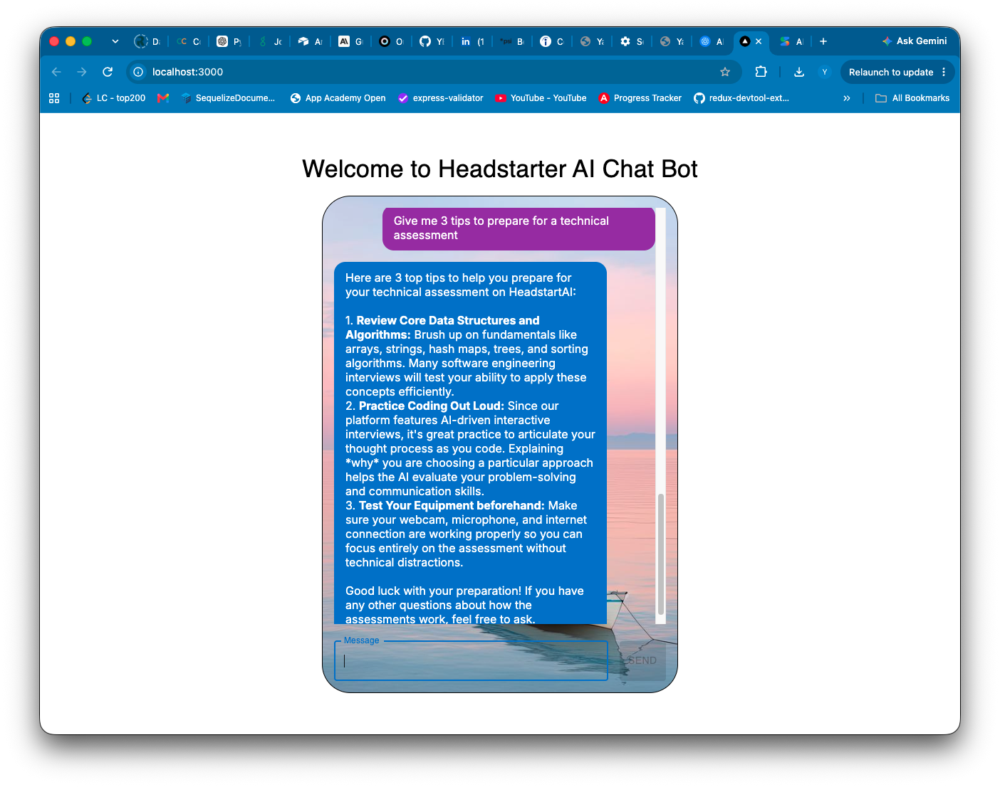
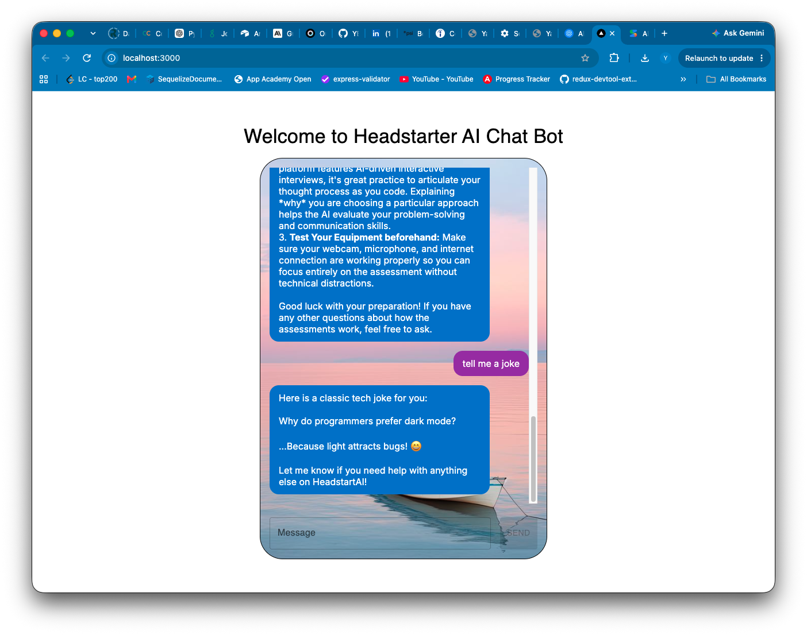

# Customer Support AI

An AI customer-support chatbot for Headstarter (a platform for AI-driven software-engineering interview practice), built during the **Headstarter AI Fellowship** (2024).

Users chat with an assistant that answers questions about scheduling interviews, preparing for assessments, understanding AI feedback and fixing common technical issues. Replies **stream in word by word** as the model writes them, and the assistant sees the **whole conversation**, so follow-up questions work naturally.

<!-- Add a screenshot: save one as public/screenshot.png and uncomment the next line -->




## Tech stack

- **Next.js 14** (App Router) and **React 18**
- **Google Gemini API** (`gemini-3.6-flash`, via the official `@google/genai` SDK) with streaming responses
  - *Originally built on the OpenAI API during the fellowship; later migrated to Gemini.*
- **Material UI** for the interface

## How it works

1. The browser sends the chat history to the `/api/chat` route (`app/api/chat/route.js`).
2. The route **checks the input**: it keeps only user and assistant messages (so a client can't inject its own system prompt), limits message length and history size, then adds the support-agent system prompt.
3. It converts the chat to Gemini's format and calls `generateContentStream`, passing each piece of text back to the browser as a plain-text stream.
4. The page (`app/page.js`) reads the stream and appends each piece to the assistant's message as it arrives.

### Reliability and safety details

- **Safe rendering:** model output is rendered as plain text through React (only `**bold**` is formatted), never as raw HTML, so a malicious or malformed reply cannot inject scripts into the page.
- **Error handling:** a missing or invalid API key, rate limit, bad request, or Gemini outage returns a clear error, and the chat shows a friendly message instead of hanging.
- **Responsive layout:** the chat window adapts to phone screens.

## Run it locally

Requires Node.js 20+ and a free [Gemini API key](https://aistudio.google.com/apikey).

```bash
git clone https://github.com/YElnadi/customer-support-ai.git
cd customer-support-ai
npm install
echo "GEMINI_API_KEY=your-key-here" > .env.local
npm run dev
```

Open http://localhost:3000 and send a message.

## Author

**Yasmine Elnadi** · [Portfolio](https://yelnadi.github.io/) · [GitHub](https://github.com/YElnadi)
